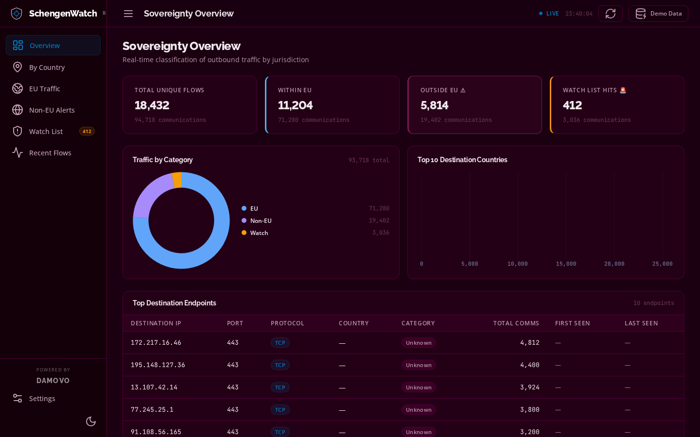
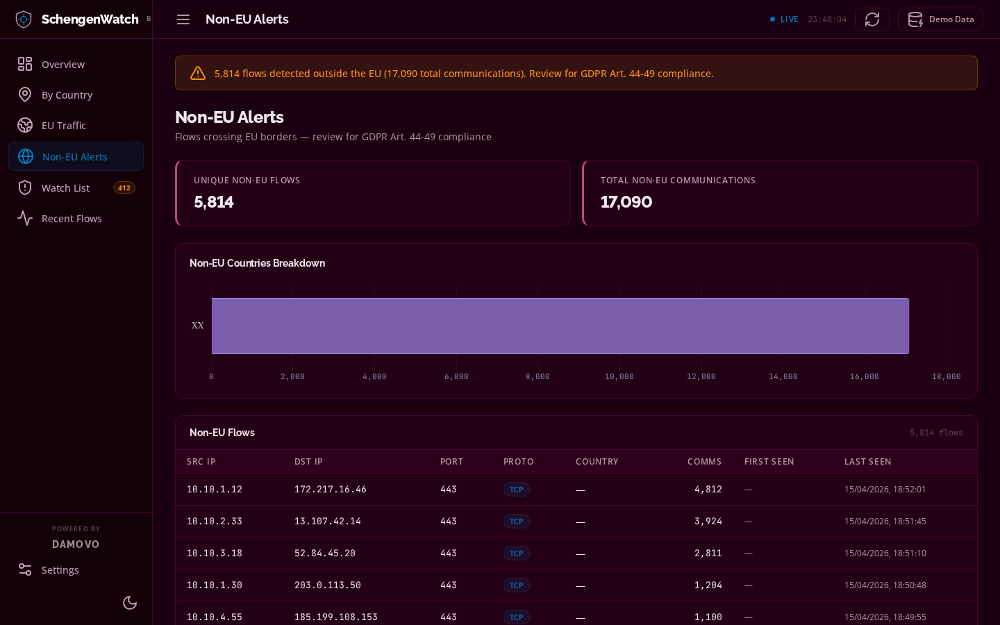
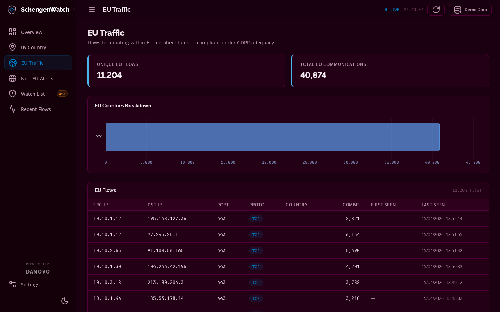
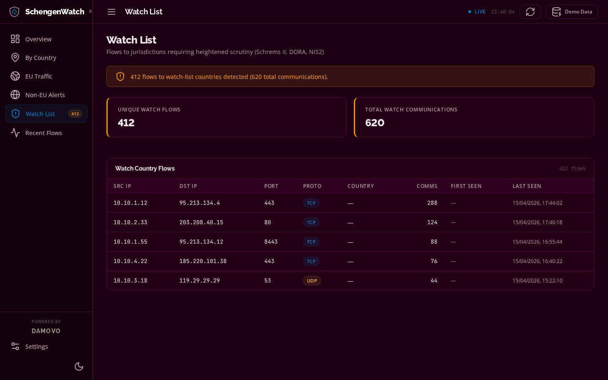
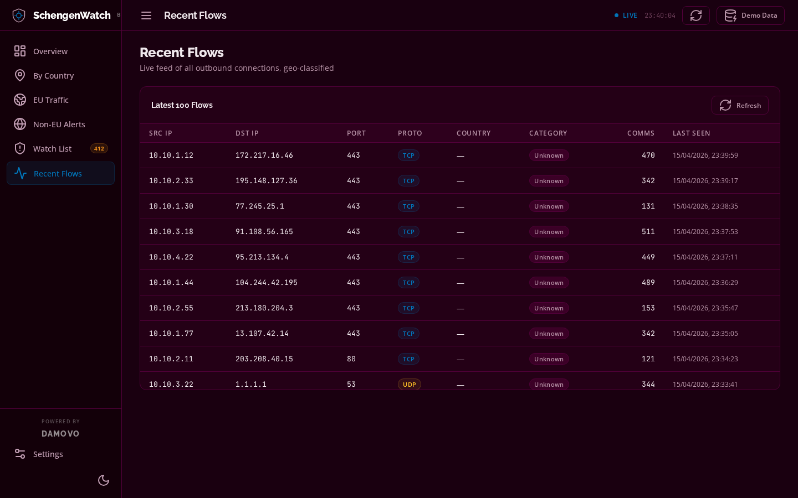

# SchengenWatch — EU Data Sovereignty Validator

**Open-source network traffic validator for organisations operating under EU data sovereignty requirements.**

SchengenWatch monitors outbound network communications in real time and alerts when traffic crosses EU borders — giving security, compliance, and legal teams continuous visibility into whether data flows respect jurisdictional boundaries required by GDPR, NIS2, DORA, and TISAX.

---

## Why SchengenWatch

EU-based organisations face increasing regulatory pressure to demonstrate that data — and the network communications that carry it — remain within defined jurisdictions. Auditors ask. Regulators require it. Proving it has historically meant expensive SIEM deployments or manual log reviews.

SchengenWatch is a lightweight, self-hosted alternative that answers one question continuously:

> **Is our traffic staying where it should?**

It classifies every outbound connection by destination country, flags anything leaving the EU, and highlights communications to specific high-interest jurisdictions. No data leaves your environment. No SaaS dependency. No per-seat licensing.

---

## Dashboard Screenshots

> All views shown with demo data. The Damovo brand theme is applied throughout.

### Sovereignty Overview

Real-time KPI summary — total flows, EU/non-EU split, watch-list hits, and a live donut chart with top destination countries.



---

### Non-EU Alerts

Primary compliance alert view — every flow crossing EU borders, flagged for GDPR Art. 44-49 review.



---

### EU Traffic

Flows terminating within EU member states — compliant under GDPR adequacy provisions.



---

### Watch List

Flows to user-defined high-risk jurisdictions. Default watch countries: Russia, China, North Korea, Iran.



---

### Recent Flows

Live feed of the last 100 connections, auto-refreshing every 30 seconds.




---

## Architecture

```
Firewall / Router
      │
      │  syslog  (UDP/TCP 514, TCP 601, TCP 6514)
      │  NetFlow v5/v9/IPFIX  (UDP 2055)
      │  PCAP upload  (HTTP POST /api/ingest/pcap)
      │
      ├─────────────────────┬──────────────────────┐
      ▼                     ▼                      │
┌───────────┐    ┌──────────────────┐              │
│ syslog-ng │    │ netflow          │              │
│ (Alpine)  │    │ collector        │              │
│ Parse +   │    │ v5/v9/IPFIX      │              │
│ strip meta│    │ UDP listener     │              │
└─────┬─────┘    └────────┬─────────┘              │
      │ JSONL             │ direct upsert          │
      ▼                   │                        │
┌─────────────────┐       │                        │
│ processor       │◀──────┘                        │
│ tail → SQLite   │                                │
└────────┬────────┘                                │
         │ /data/schengenwatch.db                       │
         ▼                                         │
┌─────────────────────────┐                        │
│ backend                 │◀───────────────────────┘
│ FastAPI + GeoLite2      │
│ REST API + dashboard    │
│ http://localhost:8000   │
└─────────────────────────┘
```

---

## Data Sovereignty Views

| View | Purpose |
|---|---|
| **Overview** | KPI summary — in-country, EU, non-EU, and watch-country flow counts |
| **In-Country** | Flows staying within your home country (e.g. Germany only) |
| **EU Traffic** | Flows within EU member states — compliant under GDPR adequacy |
| **Non-EU Traffic** | Flows leaving the EU — primary compliance alert view |
| **Watch Countries** | Flows to user-defined high-risk jurisdictions (e.g. CN, RU, US) |
| **Recent Flows** | Live feed of the last 100 connections |
| **Settings** | Configure home country, watch list, API endpoint |

---

## Regulatory Context

| Regulation | Relevance |
|---|---|
| **GDPR Art. 44-49** | Restricts personal data transfers outside the EEA without adequate safeguards |
| **NIS2 Directive** | Requires operators of essential services to control and audit data flows |
| **DORA (EU 2022/2554)** | Financial entities must demonstrate ICT supply chain and data residency controls |
| **TISAX** | Automotive industry information security — data localisation is assessed |
| **Schrems II** | Invalidated Privacy Shield; transfers to US require explicit legal basis |

SchengenWatch does not replace legal advice or a formal Data Protection Impact Assessment. It provides the continuous technical evidence that supports those processes.

---

## Prerequisites

| Requirement | Notes |
|---|---|
| Docker Engine ≥ 24 | Compose v2 included |
| MaxMind GeoLite2-Country.mmdb | Free — see below |
| Firewall configured to send syslog or NetFlow | UDP 514 / TCP 514 / UDP 2055 |

### Obtaining GeoLite2-Country.mmdb

1. Create a free account at [maxmind.com/en/geolite2/signup](https://www.maxmind.com/en/geolite2/signup)
2. Download **GeoLite2 Country** (`.mmdb` format)
3. Place the file at `./mmdb/GeoLite2-Country.mmdb`

```bash
mkdir -p mmdb
cp ~/Downloads/GeoLite2-Country_*/GeoLite2-Country.mmdb mmdb/
```

---

## Quick Start

```bash
git clone https://github.com/andrewsmhay/schengenwatch.git
cd schengenwatch

# 1. Add your MaxMind database
mkdir -p mmdb
cp /path/to/GeoLite2-Country.mmdb mmdb/

# 2. Start everything
docker compose up -d

# 3. Open the dashboard
open http://localhost:8000

# 4. Inject demo data (no firewall required)
curl "http://localhost:8000/api/db/seed?n=500"
```

---

## Input Sources

### Syslog (UDP/TCP 514, TCP 601)

Supported firewall log formats:

- **Cisco ASA / PIX / FTD** — Built/Teardown connection messages
- **iptables / nftables** — `SRC= DST= PROTO= DPT=` format
- **Palo Alto Networks** — CSV traffic log
- **Generic key=value** — Fortinet, Check Point, pfSense, OPNsense, MikroTik

**Cisco ASA:**
```
logging enable
logging host inside <SCHENGENWATCH_IP> 514
logging trap informational
```

**iptables:**
```bash
# /etc/rsyslog.d/99-schengenwatch.conf
*.* @<SCHENGENWATCH_IP>:514
```

**pfSense / OPNsense:** Status > System Logs > Settings > Remote Logging > `<SCHENGENWATCH_IP>:514`

---

### NetFlow / IPFIX (UDP 2055)

NetFlow provides richer data (byte counts, packet counts, flow duration) and is the preferred input for enterprise environments.

**Cisco IOS / IOS-XE (v9):**
```
ip flow-export version 9
ip flow-export destination <SCHENGENWATCH_IP> 2055
interface GigabitEthernet0/0
 ip flow ingress
 ip flow egress
```

**Palo Alto (IPFIX):**
```
Device > Server Profiles > NetFlow
  Server: <SCHENGENWATCH_IP>  Port: 2055  Version: IPFIX
Network > Interfaces > <WAN interface> > NetFlow Profile
```

**Fortinet FortiGate (v9):**
```
config system netflow
  set collector-ip <SCHENGENWATCH_IP>
  set collector-port 2055
end
```

**MikroTik (v5):**
```
/ip traffic-flow
set enabled=yes interfaces=all
/ip traffic-flow target
add dst-address=<SCHENGENWATCH_IP> port=2055 version=5
```

**Juniper SRX (v9):**
```
set forwarding-options sampling instance default family inet \
    output flow-server <SCHENGENWATCH_IP> port 2055 version9 template ipv4
```

---

### PCAP Upload

Upload a previously captured packet capture file and SchengenWatch will extract all TCP/UDP flows, geo-classify them, and add them to the database.

```bash
# Place pcap in the pcaps/ directory (git-ignored)
cp ~/Downloads/capture.pcap ./pcaps/

# Upload
curl -X POST http://localhost:8000/api/ingest/pcap \
     -F "file=@./pcaps/capture.pcap"
```

Supported formats: `.pcap`, `.pcapng`, `.cap`

Flows are deduplicated — if a flow already exists from syslog or NetFlow, `last_seen` and `count` are updated.

---

## API Reference

| Method | Path | Description |
|---|---|---|
| GET | `/api/health` | Liveness probe (DB + MMDB status) |
| GET | `/api/stats/summary` | All KPI counts |
| GET | `/api/traffic/country?iso=DE` | Flows to a specific country |
| GET | `/api/traffic/eu` | EU flows |
| GET | `/api/traffic/non-eu` | Non-EU flows (primary alert) |
| GET | `/api/traffic/watch` | Watch-country flows |
| GET | `/api/top/destinations?n=25` | Top N endpoints by count |
| GET | `/api/top/countries?n=10` | Top N countries by count |
| GET | `/api/recent?limit=100` | Most recent flows |
| GET | `/api/countries/list` | All countries seen in traffic |
| GET | `/api/settings/watch` | Current watch countries |
| POST | `/api/settings/watch` | Update watch countries `{"countries":["RU","CN"]}` |
| POST | `/api/ingest/pcap` | Upload `.pcap` / `.pcapng`, extract flows |
| GET | `/api/db/seed?n=300` | Inject demo data (dev only) |

---

## Environment Variables

### processor

| Variable | Default | Description |
|---|---|---|
| `SENTINEL_LOG_FILE` | `/var/log/perimeter/traffic.jsonl` | syslog-ng output path |
| `SENTINEL_DB_PATH` | `/data/schengenwatch.db` | SQLite database path |
| `SENTINEL_BATCH` | `50` | Rows per commit |
| `SENTINEL_POLL` | `0.5` | File poll interval (seconds) |

### netflow

| Variable | Default | Description |
|---|---|---|
| `NETFLOW_HOST` | `0.0.0.0` | Listen address |
| `NETFLOW_PORT` | `2055` | Listen port |
| `SENTINEL_DB_PATH` | `/data/schengenwatch.db` | SQLite database path |

### backend

| Variable | Default | Description |
|---|---|---|
| `SENTINEL_DB_PATH` | `/data/schengenwatch.db` | SQLite database path |
| `MAXMIND_DB_PATH` | `/mmdb/GeoLite2-Country.mmdb` | MaxMind MMDB path |
| `STATIC_DIR` | `/app/static` | Dashboard static files |

---

## SQLite Schema

```sql
CREATE TABLE traffic (
    id         TEXT    PRIMARY KEY,   -- UUID v4
    src_ip     TEXT    NOT NULL,
    dst_ip     TEXT    NOT NULL,
    dst_port   INTEGER NOT NULL,
    protocol   TEXT    NOT NULL,      -- TCP | UDP
    first_seen TEXT    NOT NULL,      -- ISO-8601 UTC
    last_seen  TEXT    NOT NULL,      -- updated on every hit
    count      INTEGER NOT NULL DEFAULT 1
);
-- Unique key: (src_ip, dst_ip, dst_port, protocol)
```

---

## Security Notes

- All metadata (hostname, facility, severity, timestamps, process names) is stripped at ingest. Only the four traffic fields survive.
- All IP addresses and port numbers are validated before writing to SQLite.
- No authentication is included. Place a reverse proxy (nginx, Caddy, Traefik) with TLS and basic auth in front of port 8000 before network exposure.
- PCAP files are excluded from git — they may contain sensitive traffic data.

---

## File Structure

```
schengenwatch/
├── docker-compose.yml
├── README.md
├── .gitignore
├── mmdb/                          ← place GeoLite2-Country.mmdb here
├── data/                          ← SQLite DB (runtime)
├── pcaps/                         ← drop .pcap files here (git-ignored)
├── syslog-ng/
│   ├── Dockerfile
│   └── syslog-ng.conf
├── processor/
│   ├── Dockerfile
│   ├── requirements.txt
│   └── processor.py
├── netflow/
│   ├── Dockerfile
│   └── collector.py
├── backend/
│   ├── Dockerfile
│   ├── requirements.txt
│   └── main.py
└── dashboard/
    ├── index.html
    ├── style.css
    └── app.js
```

---

## Contributing

SchengenWatch is open source under the MIT licence. Contributions welcome — particularly:

- Additional firewall log parsers (syslog-ng)
- IPv6 flow support
- Alert webhooks (Slack, Teams, email) for non-EU traffic threshold breaches
- Grafana data source plugin
- Kubernetes / Helm deployment manifests

---

## Licence

MIT — see [LICENSE](LICENSE)
